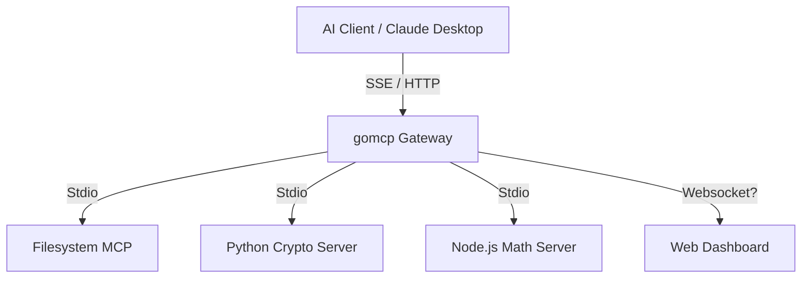

<div align="center">
  
  <h1>gomcp-pilot</h1>
  <p>
    <b>一个用 Go 编写的高性能 Model Context Protocol (MCP) 网关</b>
  </p>

  [](go.mod)
  [](LICENSE)
</div>

**gomcp-pilot** (Go MCP Pilot)

**gomcp-pilot** 是一个用 Go 编写的高性能 Model Context Protocol (MCP) 网关。它旨在连接大语言模型 (LLM) 与本地工具、服务和文件系统。

本项目作为一个 "Pilot"（领航员），充当 AI Agent 与操作系统之间的中间层，提供统一的协议转换、权限控制和可视化监控。

## 核心特性

*   **高性能网关**: 基于 Go 语言，并发处理多个 Upstream MCP Server。
*   **多语言支持 (Polyglot)**: 可以连接 Python, Node.js, Go 等任意语言编写的 MCP Server（通过 Stdio）。
*   **全协议支持**: 
    *   **Tools**: 动态发现和调用工具。
    *   **Resources**: 统一聚合和读取资源（如文件、系统状态）。
    *   **SSE**: 支持 Server-Sent Events 协议，兼容 Claude Desktop 等标准客户端。
*   **可视化界面**:
    *   **TUI (终端界面)**: 实时监控 Traffic，拦截请求，查看详细日志。
    *   **Web Dashboard**: 现代化的 React 界面，浏览工具和资源列表。
*   **安全可控**:
    *   Token 鉴权。
    *   Human-in-the-loop: 关键操作（如文件写入）可配置为需人工批准。

## 快速开始

### 前置要求
*   Go 1.23+
*   Node.js 18+ (用于 Web Dashboard)
*   Python 3.10+ (用于示例 Server 和 AI Client)

### 开发环境一键启动

我们提供了一个便捷的控制脚本来管理所有服务：

```bash
# 1. 启动所有服务 (后端 + 前端) 并挂起在后台
./scripts/dev/control.sh start

# 2. 查看实时日志
./scripts/dev/control.sh logs

# 3. 停止所有服务
./scripts/dev/control.sh stop

# 4. 进入 TUI 交互模式 (会自动停止后台服务以释放端口)
./scripts/dev/control.sh tui
```

启动后：
*   **API Gateway**: `http://localhost:8080`
*   **Web Dashboard**: `http://localhost:5173`

### 手动构建与运行

如果您更喜欢手动操作：

```bash
# 编译
go build -o bin/gomcp ./cmd/gomcp

# 启动 TUI 模式
./bin/gomcp start

# 启动无头模式 (Headless Server)
./bin/gomcp serve

# 启动 Web Dashboard
cd web && npm install && npm run dev
```

## 架构



## 配置文件 (`config.yaml`)

```yaml
port: 8080
auth_token: "TEST" # 简单的 Bearer Token 鉴权

upstreams:
  - name: "filesystem"
    command: "./bin/gomcp"
    args: ["stdio"]
    env: []
    auto_approve: false # TUI 模式下需要人工批准

  - name: "crypto-py"
    command: "python3"
    args: ["scripts/servers/crypto_server.py"]
    auto_approve: true

  - name: "math-js"
    command: "node"
    args: ["scripts/servers/math_server.js"]
    auto_approve: true
```

## Roadmap

### Phase 1: Core Foundation (已完成)
- [x] **MCP Protocol**: 完整实现 MCP 协议核心 (Client & Server)。
- [x] **Gateway Transport**: 支持 Stdio 传输协议，稳定连接本地进程。
- [x] **Polyglot Support**: 完美支持 Python, Node.js, Go 等多语言 Server。
- [x] **SSE Integration**: 实现 Server-Sent Events，兼容 Claude Desktop。

### Phase 2: Observability & Control (已完成)
- [x] **TUI Monitor**: 强大的终端交互界面，流量实时监控。
- [x] **Web Dashboard**: 基于 React 的现代化管理面板。
- [x] **Human-in-the-loop**: 敏感操作人工审批机制。
- [x] **Configuration**: 灵活的 YAML 配置管理。

### Phase 3: Advanced Features (开发中)
- [ ] **Remote Upstreams**: 支持通过 HTTP/SSE 连接远程 MCP Server。
- [ ] **Advanced Auth**: 集成 OAuth2 或更细粒度的 API Key 管理。
- [ ] **Plugin System**: 支持自定义中间件插件。
- [ ] **Docker Support**: 提供标准 Docker 镜像与 K8s 部署清单。
- [ ] **WebSockets**: 全双工通信支持，提升实时性。

## API 参考

### Core Endpoints
*   `GET /sse`: MCP SSE 接入点 (Client 连接此处)
*   `POST /mcp/message`: JSON-RPC 消息交互端点

### Legacy / Debug Endpoints
*   `GET /tools/list?upstream=name`
*   `POST /tools/call`
*   `GET /resources/list?upstream=name`
*   `GET /resources/read?uri=...`

所有接口均需携带 Header: `Authorization: Bearer <token>`
