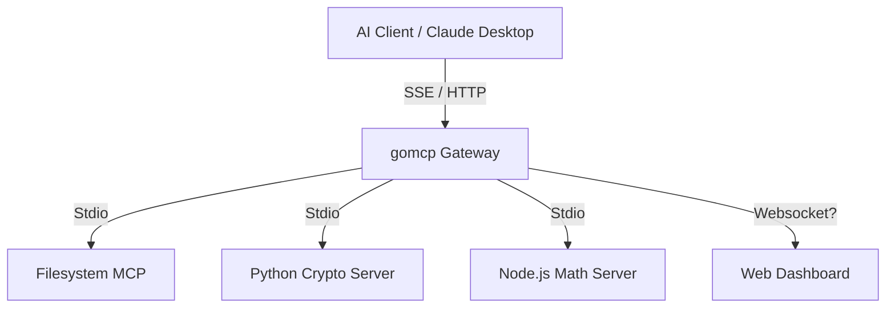

# gomcp-pilot (Go MCP Pilot)

**gomcp-pilot** 是一个用 Go 编写的高性能 Model Context Protocol (MCP) 网关。它旨在连接大语言模型 (LLM) 与本地工具、服务和文件系统。

本项目作为一个 "Pilot"（领航员），充当 AI Agent 与操作系统之间的中间层，提供统一的协议转换、权限控制和可视化监控。

## 核心特性

*   **高性能网关**: 基于 Go 语言，并发处理多个 Upstream MCP Server。
*   **多语言支持 (Polyglot)**: 可以连接 Python, Node.js, Go 等任意语言编写的 MCP Server（通过 Stdio）。
*   **全协议支持**: 
    *   **Tools**: 动态发现和调用工具。
    *   **Resources**: 统一聚合和读取资源（如文件、系统状态）。
    *   **SSE**: 支持 Server-Sent Events 协议，兼容 Claude Desktop 等标准客户端。
*   **可视化界面**:
    *   **TUI (终端界面)**: 实时监控 Traffic，拦截请求，查看详细日志。
    *   **Web Dashboard**: 现代化的 React 界面，浏览工具和资源列表。
*   **安全可控**:
    *   Token 鉴权。
    *   Human-in-the-loop: 关键操作（如文件写入）可配置为需人工批准。

## 快速开始

### 前置要求
*   Go 1.23+
*   Node.js 18+ (用于 Web Dashboard)
*   Python 3.10+ (用于示例 Server 和 AI Client)

### 开发环境一键启动

我们提供了一个便捷的控制脚本来管理所有服务：

```bash
# 1. 启动所有服务 (后端 + 前端) 并挂起在后台
./scripts/dev/control.sh start

# 2. 查看实时日志
./scripts/dev/control.sh logs

# 3. 停止所有服务
./scripts/dev/control.sh stop

# 4. 进入 TUI 交互模式 (会自动停止后台服务以释放端口)
./scripts/dev/control.sh tui
```

启动后：
*   **API Gateway**: `http://localhost:8080`
*   **Web Dashboard**: `http://localhost:5173`

### 手动构建与运行

如果您更喜欢手动操作：

```bash
# 编译
go build -o bin/gomcp ./cmd/gomcp

# 启动 TUI 模式
./bin/gomcp start

# 启动无头模式 (Headless Server)
./bin/gomcp serve

# 启动 Web Dashboard
cd web && npm install && npm run dev
```

## 架构



## 配置文件 (`config.yaml`)

```yaml
port: 8080
auth_token: "TEST" # 简单的 Bearer Token 鉴权

upstreams:
  - name: "filesystem"
    command: "./bin/gomcp"
    args: ["stdio"]
    env: []
    auto_approve: false # TUI 模式下需要人工批准

  - name: "crypto-py"
    command: "python3"
    args: ["scripts/servers/crypto_server.py"]
    auto_approve: true

  - name: "math-js"
    command: "node"
    args: ["scripts/servers/math_server.js"]
    auto_approve: true
```

## API 参考

*   `GET /tools/list?upstream=name`: 获取工具列表
*   `POST /tools/call`: 调用工具
*   `GET /resources/list?upstream=name`: 获取资源列表
*   `GET /resources/read?uri=...`: 读取资源内容
*   `GET /sse`: MCP SSE 端点

## 状态
目前项目处于 **Active Development** 阶段。已完成核心协议对接和多语言 Server 集成。
    *   Header: `Authorization: Bearer <token>`

*   `POST /mcp/message`: MCPJSON-RPC 消息端点
    *   用于发送标准 MCP 协议消息 (如 `tools/call`, `initialize`)。
*   `POST /tools/call`: (Legacy) 简易工具调用接口
    *   Body: `{"upstream": "name", "tool": "func_name", "arguments": {...}}`
