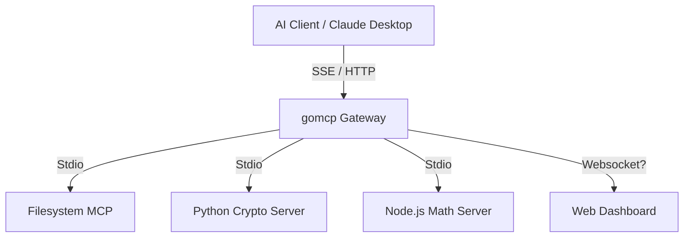

<div align="center">
  
  <h1>gomcp-pilot</h1>
  <p>
    <b>A high-performance Model Context Protocol (MCP) gateway written in Go</b>
  </p>

  [](go.mod)
  [](LICENSE)

  [ **English** | [中文](../README.md) ]
</div>

**gomcp-pilot** is a high-performance Model Context Protocol (MCP) gateway written in Go. It is designed to connect Large Language Models (LLMs) with local tools, services, and file systems.

The project is named "Pilot" to serve as an assistant guide for AI Agents: while handling protocol conversion, it provides unified access control and visual monitoring, helping developers better understand and control AI behavior.

## Core Features

*   **High-Performance Gateway**: Built with Go, handling multiple Upstream MCP Servers concurrently.
*   **Polyglot Support**: Connects to MCP Servers written in any language (Python, Node.js, Go, etc.) via Stdio.
*   **Full Protocol Support**:
    *   **Tools**: Dynamic discovery and invocation.
    *   **Resources**: Unified aggregation and reading (e.g., files, system status).
    *   **SSE**: Server-Sent Events support, compatible with standard clients like Claude Desktop.
*   **Visual Interface**:
    *   **TUI (Terminal UI)**: Real-time traffic monitoring, request interception, and detailed logs.
    *   **Web Dashboard**: Modern React interface for browsing tools and resources.
*   **Secure & Controllable**:
    *   Token Authentication.
    *   Human-in-the-loop: Critical operations (like file writing) can be configured to require manual approval.

## Quick Start

### Prerequisites
*   Go 1.23+
*   Node.js 18+ (for Web Dashboard)
*   Python 3.10+ (for example Server and AI Client)

### One-Click Development Start

We provide a convenient control script to manage all services:

```bash
# 1. Start all services (backend + frontend) and run in background
./scripts/dev/control.sh start

# 2. View real-time logs
./scripts/dev/control.sh logs

# 3. Stop all services
./scripts/dev/control.sh stop

# 4. Enter TUI interactive mode (automatically stops background services to free ports)
./scripts/dev/control.sh tui
```

After startup:
*   **API Gateway**: `http://localhost:8080`
*   **Web Dashboard**: `http://localhost:5173`

### Manual Build & Run

If you prefer manual operations:

```bash
# Compile
go build -o bin/gomcp ./cmd/gomcp

# Start TUI mode
./bin/gomcp start

# Start Headless Server mode
./bin/gomcp serve

# Start Web Dashboard
cd web && npm install && npm run dev
```

## Architecture



## Configuration (`config.yaml`)

```yaml
port: 8080
auth_token: "TEST" # Simple Bearer Token Authentication

upstreams:
  - name: "filesystem"
    command: "./bin/gomcp"
    args: ["stdio"]
    env: []
    auto_approve: false # Manual approval required in TUI mode

  - name: "crypto-py"
    command: "python3"
    args: ["scripts/servers/crypto_server.py"]
    auto_approve: true

  - name: "math-js"
    command: "node"
    args: ["scripts/servers/math_server.js"]
    auto_approve: true
```

## Roadmap

### Phase 1: Core Foundation (Completed)
- [x] **MCP Protocol**: Complete MCP protocol core implementation (Client & Server).
- [x] **Gateway Transport**: Support Stdio transport protocol, stable connection to local processes.
- [x] **Polyglot Support**: Perfect support for multi-language Servers like Python, Node.js, Go.
- [x] **SSE Integration**: Implement Server-Sent Events, compatible with Claude Desktop.

### Phase 2: Observability & Control (Completed)
- [x] **TUI Monitor**: Powerful terminal interactive interface, real-time traffic monitoring.
- [x] **Web Dashboard**: React-based modern management panel.
- [x] **Human-in-the-loop**: Approval mechanism for sensitive operations.
- [x] **Configuration**: Flexible YAML configuration management.

### Phase 3: Advanced Features (In Development)
- [ ] **Remote Upstreams**: Support connecting remote MCP Servers via HTTP/SSE.
- [ ] **Advanced Auth**: Integrate OAuth2 or more granular API Key management.
- [ ] **Plugin System**: Support custom middleware plugins.
- [ ] **Docker Support**: Provide standard Docker images and K8s deployment manifests.
- [ ] **WebSockets**: Full-duplex communication support to improve real-time performance.

## API Reference

### Core Endpoints
*   `GET /sse`: MCP SSE entry point (Client connects here)
*   `POST /mcp/message`: JSON-RPC message interaction endpoint

### Legacy / Debug Endpoints
*   `GET /tools/list?upstream=name`
*   `POST /tools/call`
*   `GET /resources/list?upstream=name`
*   `GET /resources/read?uri=...`

All interfaces must carry the Header: `Authorization: Bearer <token>`
